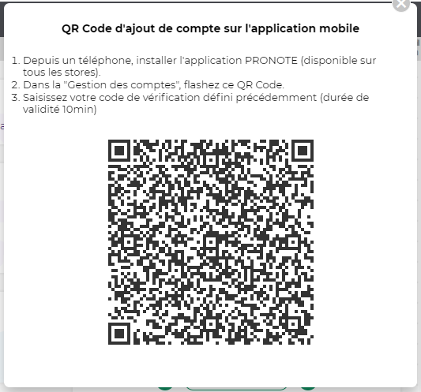

import { Tabs, TabItem, Code } from '@astrojs/starlight/components';

You can authenticate to PRONOTE using three different methods :

- [Credentials](#credentials)
- [QR Code](#qr-code)
- [Token](#token) : usually called the "next time token"

## Credentials

You can use your credentials from PRONOTE to directly authenticate.

<Tabs>
  <TabItem label="JS/TS">
     <TabItem label="npm">
```typescript
import { authenticatePronoteCredentials, PronoteApiAccountId } from "pawnote";

const client = await authenticatePronoteCredentials("https://demo.index-education.net/pronote", {
  accountTypeID: PronoteApiAccountId.Student,
  username: "demonstration",
  password: "pronotevs",

  // An unique identifier that will be used to identify the device.
  deviceUUID: "my-device-uuid"
});
```
      </TabItem>
  </TabItem>

  <TabItem label="Dart/Flutter">
```dart
final client = await Authenticator.withStudentCredentials(
  loginPortalUrl: 'https://demo.index-education.net/pronote',
  username: 'demonstration',
  password: 'pronotevs',

  // An unique identifier that will be used to identify the device.
  deviceUuid: 'my-device-uuid'
);
```
  </TabItem>
</Tabs>

## QR Code

You can generate a QR Code from the desktop PRONOTE client by doing the following :


You must enter a PIN code, here I typed `1234`, don't forget it we'll use it later.
By clicking "Générer le QR Code", you'll see a window giving you a QR Code that looks like this :



You should decode it manually. You can use online services like [zxing.org](https://zxing.org/w/decode.jspx) to decode it.

For the previous QR Code, you should get the following data :

```jsonc
{
  "jeton": "B88BE6BEEFE21F3AFF13457CD74B28728A61D2CE4DBB0E92E6BBAD26D110B99E50EF6A0529F7B5FFFCEFA7739452F22462642A3AD77B3BF2AAD34EBC9385A406C50BF6934F77B5082FF89D080253307DF8F48C7EF44EE2197879ECBD4BFD10F132659269B115F57AD495B0E01AB9F5F0",
  "login": "E641C7BAD9A59DC9D57C63F1D682895C",
  // This is the URL of my private VM instance.
  "url": "https://pronote-vm.dev/pronote/mobile.eleve.html"
}
```

Now you can simply authenticate with Pawnote using the following code :

<Tabs>
  <TabItem label="JS/TS">
```typescript
import { authenticatePronoteQRCode } from "pawnote";

const client = await authenticatePronoteQRCode({
  // The 4 numbers you typed earlier.
  pinCode: "1234", 

  // This is the data from the QR Code.
  dataFromQRCode: {
    jeton: "B88BE6BEEFE21F3AFF13457CD74B28728A61D2CE4DBB0E92E6BBAD26D110B99E50EF6A0529F7B5FFFCEFA7739452F22462642A3AD77B3BF2AAD34EBC9385A406C50BF6934F77B5082FF89D080253307DF8F48C7EF44EE2197879ECBD4BFD10F132659269B115F57AD495B0E01AB9F5F0",
    login: "E641C7BAD9A59DC9D57C63F1D682895C",
    url: "https://pronote-vm.dev/pronote/mobile.eleve.html"
  },

  // An unique identifier that will be used to identify the device.
  deviceUUID: "my-device-uuid"
});
```
  </TabItem>
  <TabItem label="Dart">
    Currently **not implemented**.
  </TabItem>
</Tabs>

## Token

You can use the "next time token" to authenticate to PRONOTE.
This token is given whenever you authenticate (using whatever method) to PRONOTE and is availablle only one time.

As its name suggests, it's used to authenticate the next time you want to authenticate.

**You should use the same device UUID as you used to generate the token.**

Also note that this method doesn't work on demo instances (like `https://demo.index-education.net/pronote`), you must use a real instance.

<Tabs>
  <TabItem label="JS/TS">
```typescript
import { authenticateToken, PronoteApiAccountId } from "pawnote";

const client = await authenticateToken("https://pronote-vm.dev/pronote", {
  accountTypeID: PronoteApiAccountId.Student,
  username: "lisa.boulanger",
  token: "...",

  // You must keep the SAME device UUID as the one you used to generate the token.
  deviceUUID: "my-device-uuid"
});
```
  </TabItem>
  <TabItem label="Dart">
    Currently **not implemented**.
  </TabItem>
</Tabs>
